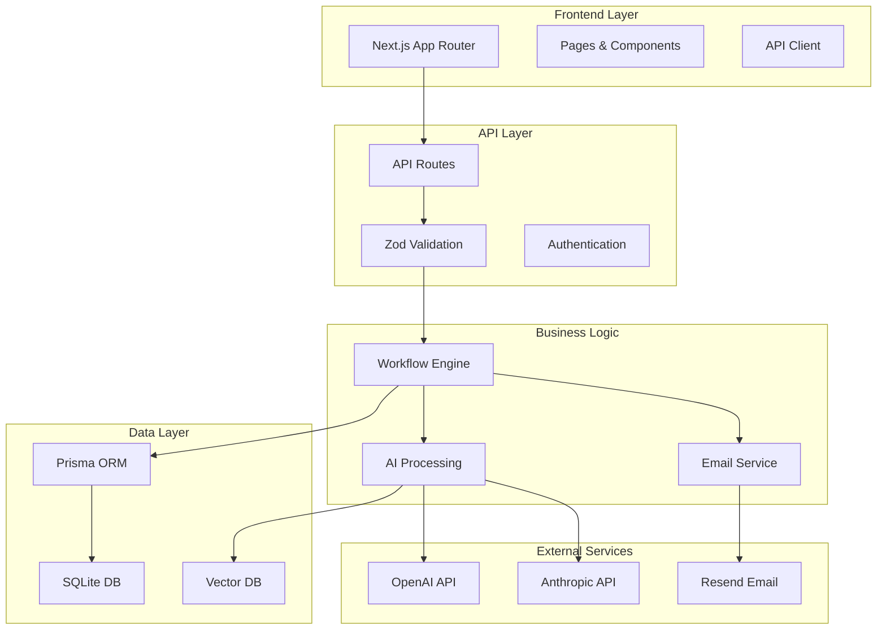

# Stellar Intelligence Platform - Architecture Documentation

## System Architecture Overview



## Core Components

### 1. Frontend Architecture

#### Technology Stack
- **Framework**: Next.js 15.5.2 with App Router
- **UI Library**: React 19.1.1
- **Styling**: Tailwind CSS 4.1.13
- **State Management**: React Hooks + Context
- **Data Fetching**: Native fetch with React Suspense
- **Animations**: Framer Motion

#### Key Pages
```
app/
├── page.tsx                 # Landing page
├── demo/page.tsx           # Interactive demo
├── admin/page.tsx          # Admin dashboard
├── claims/[id]/page.tsx    # Claim details
└── inspection/page.tsx     # Home inspection (planned)
```

### 2. Backend Architecture

#### API Structure
```
app/api/
├── claims/
│   ├── submit/route.ts     # POST: Submit new claim
│   └── [id]/route.ts       # GET/PATCH: Individual claim
├── admin/
│   └── claims/route.ts     # GET: Dashboard data
├── workflows/
│   └── trigger/route.ts    # POST: Trigger workflow
└── enrichment/
    └── suggest/route.ts     # POST: GraphRAG suggestions
```

#### Database Schema

**Core Models:**
- `Claim` - Main claims table with AI scores
- `Document` - File attachments and metadata
- `Workflow` - Workflow state tracking
- `Lead` - CRM integration data
- `Notification` - Email queue and history
- `Enrichment` - GraphRAG context storage
- `Activity` - Audit trail

### 3. Workflow Engine

The workflow engine (`lib/workflow.ts`) orchestrates the claim processing pipeline:

```typescript
class WorkflowEngine {
  steps = {
    'claim-submission': [
      'Triage Claim',          // Assign priority
      'AI Classification',     // Analyze damage
      'Generate Estimate',     // Calculate costs
      'Send Notification',     // Email insured
      'Create CRM Lead'        // Sales follow-up
    ]
  }
}
```

#### Workflow States
- `PENDING` - Awaiting processing
- `IN_PROGRESS` - Currently executing
- `COMPLETED` - Successfully finished
- `FAILED` - Error occurred
- `CANCELLED` - Manually stopped

### 4. AI Integration

#### Current Implementation
- Mock AI confidence scores (0.85-0.95)
- Mock fraud detection (0-0.3 score)
- Mock settlement scoring (0.7-0.9)

#### Planned GraphRAG Implementation
```typescript
// lib/graphrag.ts (planned)
class GraphRAG {
  // Vector embeddings with ChromaDB
  async embedClaim(claim: Claim): Promise<number[]>
  
  // Find similar claims
  async findSimilar(embedding: number[]): Promise<Claim[]>
  
  // Generate context
  async enrichContext(claimId: string): Promise<Enrichment[]>
}
```

### 5. Email System

#### Email Service (`lib/email.ts`)
- Resend integration for production
- Console logging in development
- HTML email templates
- Attachment support

#### Email Templates
- Claim Submitted
- Estimate Ready
- Document Request
- Settlement Offer

### 6. Security Architecture

#### Current Implementation
- Input validation with Zod
- SQL injection prevention (Prisma)
- XSS protection (React)
- Environment variables for secrets

#### Planned Security Features
- JWT authentication
- Role-based access control
- Rate limiting
- API key management
- Audit logging

## Data Flow

### Claim Submission Flow

1. **User Input** → Demo form collection
2. **Validation** → Zod schema validation
3. **Database** → Prisma creates claim record
4. **Workflow** → Async trigger of 5-step process
5. **AI Analysis** → Classification and scoring
6. **Notification** → Email sent to insured
7. **CRM** → Lead created for follow-up
8. **Response** → Success with claim number

### Admin Dashboard Flow

1. **Request** → Query parameters (filters, pagination)
2. **Database** → Prisma query with indexes
3. **Aggregation** → Statistics calculation
4. **Response** → Claims list + metadata

## Performance Considerations

### Current Optimizations
- Database indexes on key fields
- Server-side rendering (SSR)
- Code splitting per route
- Lazy loading for images

### Planned Optimizations
- Redis caching layer
- CDN for static assets
- Database connection pooling
- Background job processing

## Deployment Architecture

### Development
```bash
- Next.js Dev Server: Port 3000-3001
- SQLite Database: ./dev.db
- Environment: .env.local
```

### Production (Planned)
```bash
- Deployment: Vercel/AWS
- Database: PostgreSQL/Supabase
- File Storage: S3/Cloudinary
- Email: Resend
- Monitoring: Sentry/DataDog
```

## Scalability Considerations

### Horizontal Scaling
- Stateless API design
- Database read replicas
- Load balancer ready
- Microservices compatible

### Vertical Scaling
- Async processing
- Queue-based workflows
- Batch operations
- Connection pooling

## Integration Points

### Current Integrations
- Prisma ORM
- SQLite Database
- Resend Email (dev mode)

### Planned Integrations
- OpenAI GPT-4 Vision
- Anthropic Claude
- ChromaDB Vector Store
- Socket.io WebSockets
- Third-party CRMs

## Monitoring & Observability

### Current
- Console logging
- Activity table audit trail
- Development error pages

### Planned
- APM monitoring
- Error tracking (Sentry)
- Performance metrics
- Custom dashboards

## Testing Strategy

### Unit Tests (Planned)
- Workflow steps
- Email templates
- Validation schemas
- Utility functions

### Integration Tests (Planned)
- API endpoints
- Database operations
- Workflow execution
- Email delivery

### E2E Tests (Planned)
- Claim submission flow
- Admin dashboard
- User journey

## Development Workflow

### Local Development
1. Clone repository
2. Install dependencies
3. Configure environment
4. Run migrations
5. Start dev server

### CI/CD Pipeline (Planned)
1. Lint & format check
2. Type checking
3. Unit tests
4. Build verification
5. Deploy to staging
6. E2E tests
7. Deploy to production

## Tech Debt & Future Improvements

### Technical Debt
- Mock AI implementations
- No authentication system
- Limited error handling
- No rate limiting

### Future Improvements
- Real AI integration
- Advanced analytics
- Mobile application
- Offline support
- Multi-tenancy